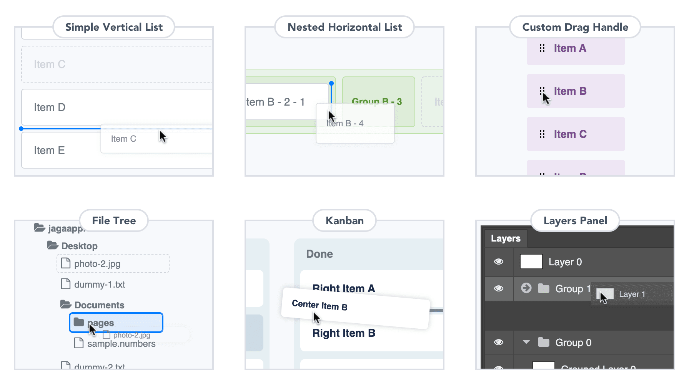
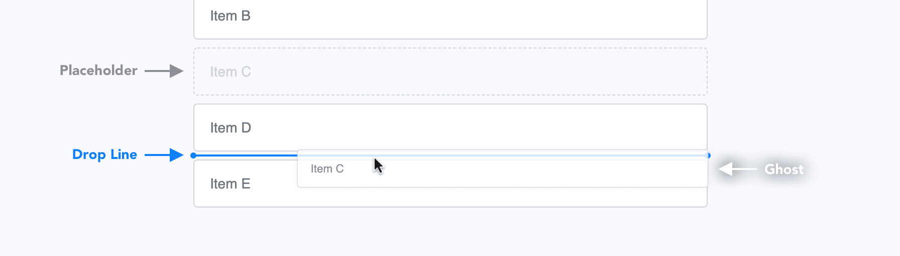
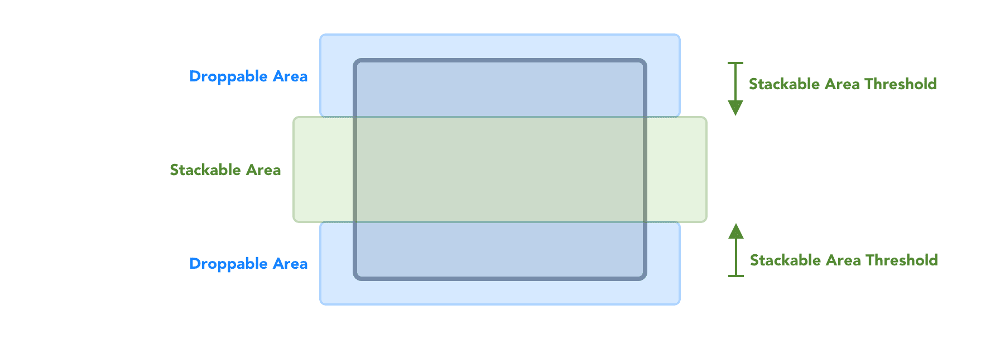

<h1 align="center">react-sortful</h1>

<h4 align="center">🔃 Sortable components for horizontal and vertical, nested, and tree forms. 🔄</h4>



```tsx
<List renderDropLine={renderDropLine} renderGhost={renderGhost} onDragEnd={onDragEnd}>
  <Item identifier="a" index={0}>Item A</Item>
  <Item identifier="b" index={1} isGroup>
    <div>Item B (Group)</div>
    <Item identifier="b-1" index={0}>Nested Item B - 1</Item>
    <Item identifier="b-2" index={1}>Nested Item B - 2</Item>
  </Item>
  <Item identifier="c" index={2}>Item C</Item>
</List>
```

<div align="center">
<a href="https://www.npmjs.com/package/react-sortful"></a>
<a href="https://circleci.com/gh/jagaapple/react-sortful"></a>
<a href="https://codecov.io/gh/jagaapple/react-sortful"></a>
<a href="https://www.chromaticqa.com/library?appId=5e6025bcf2b5b700222c2c33"></a>
<a href="https://opensource.org/licenses/MIT"></a>
<a href="https://twitter.com/jagaapple_tech"></a>
</div>

## Table of Contents

<!-- TOC depthFrom:2 -->

- [Table of Contents](#table-of-contents)
- [Features](#features)
  - [Why react-sortful](#why-react-sortful)
  - [Basic API Design](#basic-api-design)
- [Quick Start](#quick-start)
  - [Requirements](#requirements)
  - [Installation](#installation)
- [API](#api)
  - [`List` Component](#list-component)
    - [`renderDropLine` Prop](#renderdropline-prop)
    - [`renderGhost` Prop](#renderghost-prop)
    - [`renderPlaceholder` Prop](#renderplaceholder-prop)
    - [`renderStackedGroup` Prop](#renderstackedgroup-prop)
    - [`stackableAreaThreshold` Prop](#stackableareathreshold-prop)
    - [`direction` Prop](#direction-prop)
    - [`onDragStart` Prop](#ondragstart-prop)
    - [`onDragEnd` Prop](#ondragend-prop)
  - [`Item` Component](#item-component)
    - [`isLonely` Prop](#islonely-prop)
  - [`DragHandle` Component](#draghandle-component)
- [Road map](#road-map)
- [Contributing to react-sortful](#contributing-to-react-sortful)
- [License](#license)

<!-- /TOC -->


## Features
| FEATURES                                   | WHAT YOU CAN DO                                                       |
|--------------------------------------------|-----------------------------------------------------------------------|
| ⚛️ **Designed for React**                   | Get sortable components for your React project                        |
| ✨ **Simple API**                           | All you need is to know props of two components                       |
| 🔄 **Support for vertical and horizontal** | You can create vertical and horizontal lists                          |
| 👨‍👩‍👧‍👦 **Support for nested lists**         | You can stack lists in lists                                          |
| 🌴 **Creatable any forms**                 | Easy to create a draggable file tree, Kanban, layers panel, and so on |
| 🎩 **Type Safe**                           | You can use with TypeScript                                           |

When you get interested in react-sortful, see [online catalogs (Storybook)](https://www.chromaticqa.com/library?appId=5e6025bcf2b5b700222c2c33)!

> 🚧 **react-sortful is currently in beta.**
> You can use react-sortful right now, but you might need to create pull requests for advanced use cases or fix for some bugs.
> Some of APIs will have breaking changes over time.

> 🙇🏻‍♂️ **Send me pull requests.**
> This was created to develop author's project and I don't have much time, please send me pull requests instead of issues.
> I will fix any bugs as soon as possible, but will not add new features for a while.

### Why react-sortful


There are some awesome React libraries to implement drag and drop lists such as [react-beautiful-dnd](https://github.com/atlassian/react-beautiful-dnd)
and [react-sortable-hoc](https://github.com/clauderic/react-sortable-hoc). These are very useful but I like classic design such
as displaying a drop line and it's difficult to put a drop line in those libraries.

Also these libraries does not support nested lists or tree forms. react-sortful provides very simple API and make you to be able
to create any draggable lists.

**react-sortful is not for everyone**. If you don't like a drop line styles, I recommend to use those libraries instead!

### Basic API Design
```tsx
// Flat List
<List>
  <Item>1</Item>
  <Item>2</Item>
  <Item>3</Item>
</List>

// Nested List
<List>
  <Item>1</Item>
  <Item isGroup>
    <Item>2-1</Item>
    <Item>2-2</Item>
    <Item>2-3</Item>
  </Item>
  <Item>3</Item>
</List>
```

API design of react-sortful is very simple. If you want to create a flat list, it's just to put `Item` in `List` as child components.
If you want to create a nested list, it's just put `Item` in a parent `Item` as child components and give `isGroup` Prop to the parent.

Actually you have to give some Props to `List` and `Item` and compose these items programmatically, but it's easy to create any
lists if you don't forget this design.


## Quick Start
### Requirements
- npm or Yarn
- React 16.8.0 or higher ( `react` and `react-dom` packages )

### Installation
```bash
$ npm install react-sortful
```

If you are using Yarn, use the following command.

```bash
$ yarn add react-sortful
```


## API
### `List` Component
`List` is a top-level component in react-sortful. You have to wrap `Item` by `List` in any cases. `List` has some Props to control
a entire items.

| PROP NAME                | TYPE                           | DEFAULT      | DESCRIPTION                                                                                                                                   |
|--------------------------|--------------------------------|--------------|-----------------------------------------------------------------------------------------------------------------------------------------------|
| `renderDropLine`         | Function                       | *REQUIRED*   | A function to return an element used as a drop line. A drop line is a line to display a destination position to users.                        |
| `renderGhost`            | Function                       | *REQUIRED*   | A function to return an element used as a ghost. A ghost is an element following a mouse pointer when dragging.                               |
| `renderPlaceholder`      | Function                       |              | A function to return an element used as a placeholder. A placeholder is an element remaining in place when dragging the element.              |
| `renderStackedGroup`     | Function                       |              | A function to return an element used when an empty group item is hovered by a dragged any item.                                               |
| `itemSpacing`            | Number                         | `8`          | A spacing size (px) between items.                                                                                                            |
| `stackableAreaThreshold` | Number                         | `8`          | A threshold size (px) of stackable area for group items.                                                                                      |
| `direction`              | `"vertical"` or `"horizontal"` | `"vertical"` | A direction to recognize a drop area. Note that this will not change styles, so you have to apply styles such as being arranged side by side. |
| `draggingCursorStyle`    | String                         |              | A cursor style when dragging.                                                                                                                 |
| `isDisabled`             | Boolean                        | `false`      | Whether all items are not able to move, drag, and stack.                                                                                      |
| `onDragStart`            | Function                       |              | A callback function after starting of dragging.                                                                                               |
| `onDragEnd`              | Function                       | *REQUIRED*   | A callback function after end of dragging.                                                                                                    |
| `onStackGroup`           | Function                       |              | A callback function when an empty group item is hovered by a dragged item.                                                                    |
| `className`              | String                         |              |                                                                                                                                               |

> 🚫 **Styling Limitations.**
> When users drag any item, react-sortful needs to calculate a drop line position. To prevent low-performance while dragging,
> you have to give `itemSpacing` Prop as a spacing size between items if you want to specify margins.
>
> react-sortful gives the Prop value as `padding` style by `style` HTML attribute to `List` component, so you cannot overwrite padding
> parameters even if you give a CSS class name which has the style.

#### `renderDropLine` Prop
`renderDropLine` Prop requires to return a React element. Types of arguments are the following.

|                 | TYPE                                                    | TYPE NAME (for TypeScript)      |
|-----------------|---------------------------------------------------------|---------------------------------|
| `injectedProps` | `{ ref: React.RefObject; style: React.CSSProperties; }` | `DropLineRendererInjectedProps` |

Note that you have to pass `injectedProps` to a drop line element like the following, otherwise react-sortful does not work fine.

```tsx
const renderDropLine = (injectedProps: DropLineRendererInjectedProps) => (
  <div ref={injectedProps.ref} style={injectedProps.style} className="drop-line">xxx</div>
);
```

#### `renderGhost` Prop
`renderGhost` Prop requires to return a React element. Types of arguments are the following.

|        | TYPE                                                                                  | TYPE NAME (for TypeScript) |
|--------|---------------------------------------------------------------------------------------|----------------------------|
| `meta` | `{ identifier: T; groupIdentifier: T | undefined; index: number; isGroup: boolean; }` | `GhostRendererMeta<T>`     |

#### `renderPlaceholder` Prop
`renderPlaceholder` Prop requires to return a React element. Types of arguments are the following.

|                 | TYPE                                                                                  | TYPE NAME (for TypeScript)         |
|-----------------|---------------------------------------------------------------------------------------|------------------------------------|
| `injectedProps` | `{ style: React.CSSProperties; }`                                                     | `PlaceholderRendererInjectedProps` |
| `meta`          | `{ identifier: T; groupIdentifier: T | undefined; index: number; isGroup: boolean; }` | `PlaceholderRendererMeta<T>`       |

Note that you have to pass `injectedProps` to a placeholder element like the following, otherwise react-sortful does not work fine.

```tsx
const renderPlaceholder = (injectedProps: PlaceholderRendererInjectedProps) => (
  <div style={injectedProps.style} className="placeholder">xxx</div>
);
```

#### `renderStackedGroup` Prop
`renderStackedGroup` Prop requires to return a React element. Types of arguments are the following.

|                 | TYPE                                                                | TYPE NAME (for TypeScript)          |
|-----------------|---------------------------------------------------------------------|-------------------------------------|
| `injectedProps` | `{ style: React.CSSProperties; }`                                   | `StackedGroupRendererInjectedProps` |
| `meta`          | `{ identifier: T; groupIdentifier: T | undefined; index: number; }` | `StackedGroupRendererMeta<T>`       |

Note that you have to pass `injectedProps` to a stacked group item element like the following, otherwise react-sortful does not work fine.

```tsx
const renderStackedGroup = (injectedProps: PlaceholderRendererInjectedProps) => (
  <div style={injectedProps.style} className="group stacked">xxx</div>
);
```

#### `stackableAreaThreshold` Prop


If an item is given `isGroup` Prop, the item will be recognized as a group item. react-sortful does not support for stacking items
on items, but you can stack any items on item groups.

All items has droppable areas on both sides. In addition, all group items has stackable areas. `stackableAreaThreshold` Prop is
to configure the distance from droppable areas to a point of beginning of stackable areas.
If you want to set a hit box to be small, give a large value to the Prop.

#### `direction` Prop
If you want to create horizontal lists, you have to give `"horizontal"` to `direction` Prop. react-sortful will change directions
of droppable areas, but this will not affect styles. Aside from it, you need to style `Item` or its child elements in order to
arrange side by side.

#### `onDragStart` Prop
Types of arguments are the following.

|        | TYPE                                                                                  | TYPE NAME (for TypeScript) |
|--------|---------------------------------------------------------------------------------------|----------------------------|
| `meta` | `{ identifier: T; groupIdentifier: T | undefined; index: number; isGroup: boolean; }` | `DragStartMeta<T>`         |

#### `onDragEnd` Prop
Types of arguments are the following.

|        | TYPE                                                                                                                                                     | TYPE NAME (for TypeScript) |
|--------|----------------------------------------------------------------------------------------------------------------------------------------------------------|----------------------------|
| `meta` | `{ identifier: T; groupIdentifier: T | undefined; index: number; isGroup: boolean; nextGroupIdentifier: T | undefined; nextIndex: number | undefined; }` | `DragEndMeta<T>`           |

When `meta.nextIndex` is `undefined` , a dragged item will not change or will be stacked on a group item.

### `Item` Component
`Item` is used when you want to add items to a list. `Item` has some Props to control a specific item.

| PROP NAME                  | TYPE             | DEFAULT    | DESCRIPTION                                                                                                                                 |
|----------------------------|------------------|------------|---------------------------------------------------------------------------------------------------------------------------------------------|
| `identifier`               | Number or String | *REQUIRED* | A unique identifier in all items of list.                                                                                                   |
| `index`                    | Number           | *REQUIRED* | A unique and sequential index number in a parent group.                                                                                     |
| `isGroup`                  | Boolean          | `false`    | Whether an item is possible to have child items.                                                                                            |
| `isLocked`                 | Boolean          | `false`    | Whether child items are not able to move and drag. Stacking and popping child items will be allowed. Grandchild items will not be affected. |
| `isLonely`                 | Boolean          | `false`    | Whether droppable areas on both sides of an item is disabled.                                                                               |
| `isUsedCustomDragHandlers` | Boolean          | `false`    | Whether an item contains custom drag handlers in child items (not grandchildren).                                                           |

#### `isLonely` Prop
All items, contains item groups, have droppable areas on both sides. This Prop disables it, but note that this will not affect to
droppable areas of adjacent items.

### `DragHandle` Component
By default, elements wrapped by `Item` are possible to drag and drop. If you want to limit a draggable range, `DragHandle` would
be needed.

| PROP NAME   | TYPE   | DEFAULT | DESCRIPTION |
|-------------|--------|---------|-------------|
| `className` | String |         |             |

> 🚫 **Placeholder Limitations.**
> If you use `DragHandle` in some items, **don't forget containing `DragHandle` in a placeholder element** in the items,
> otherwise drag and drop will not work fine.


## Road map
> 🙇🏻‍♂️ **Send me pull requests.**
> I have plans to support for the following features, but I don't have time to implement them, so release dates are not decided.
> If you have much time, send me pull requests!

- Virtual lists support
- Mobile devices (touch events) support
- Multi-drag support
- Improve for semantic rendering
- Remove some limitations


## Contributing to react-sortful
Bug reports and pull requests are welcome on GitHub at
[https://github.com/jagaapple/react-sortful](https://github.com/jagaapple/react-sortful). This project
is intended to be a safe, welcoming space for collaboration, and contributors are expected to adhere to the
[Contributor Covenant](http://contributor-covenant.org) code of conduct.

Please read [Contributing Guidelines](./.github/CONTRIBUTING.md) before development and contributing.


## License
The library is available as open source under the terms of the [MIT License](http://opensource.org/licenses/MIT).

Copyright 2020 Jaga Apple. All rights reserved.
